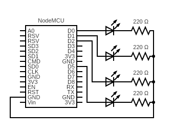

# Who's Home

A NodeMCU project that tells me at a glance who is home. The NodeMCU monitors packets and cross references MAC addresses. LED's light up for each person when they are home. The time the light stays on for grows over time, depending on how often phones broadcast in the background. This was built using parts from [RicardoOliveira/FriendDetector](https://github.com/RicardoOliveira/FriendDetector) after giving up pinging and an attempt at sending malformed tcp packets.

## Parts and Installation

- NodeMCU v3
- LEDs
- 220 ohm resisters

Compiled and installed using Arduino IDE.

## TODO

- Schematic
- Pictures
